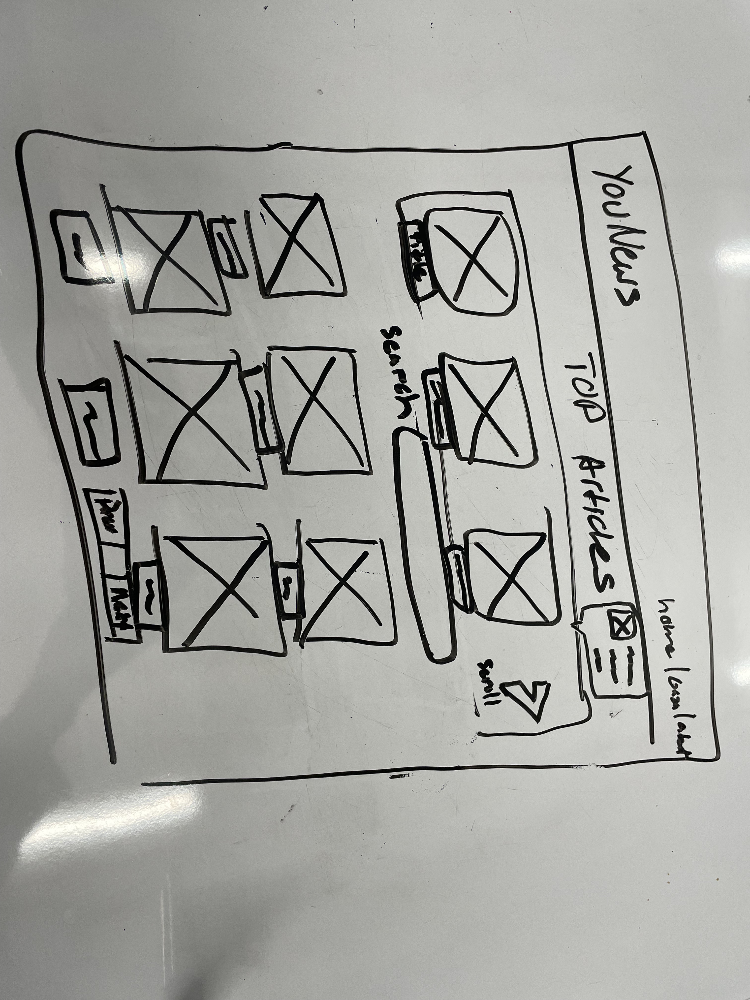
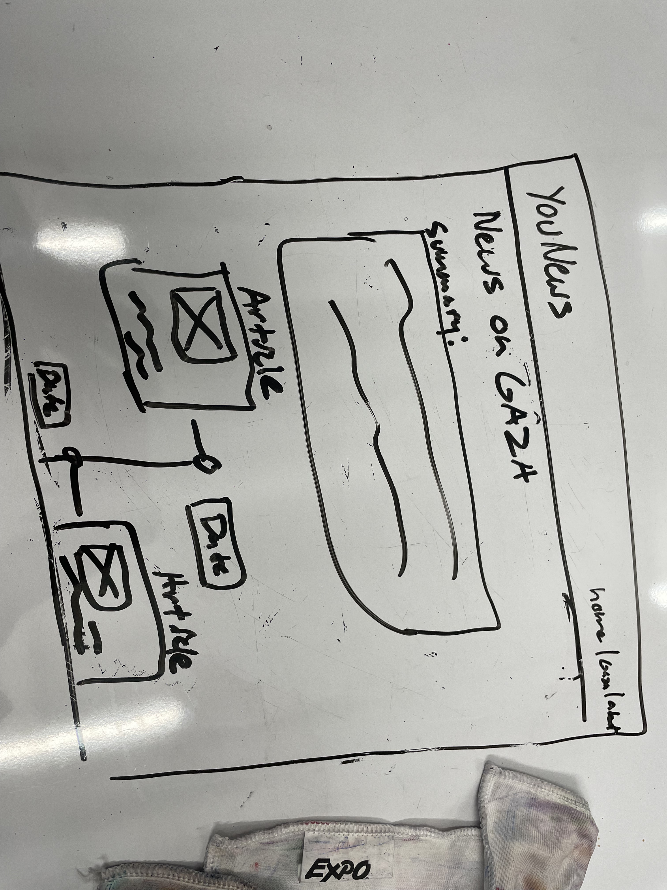
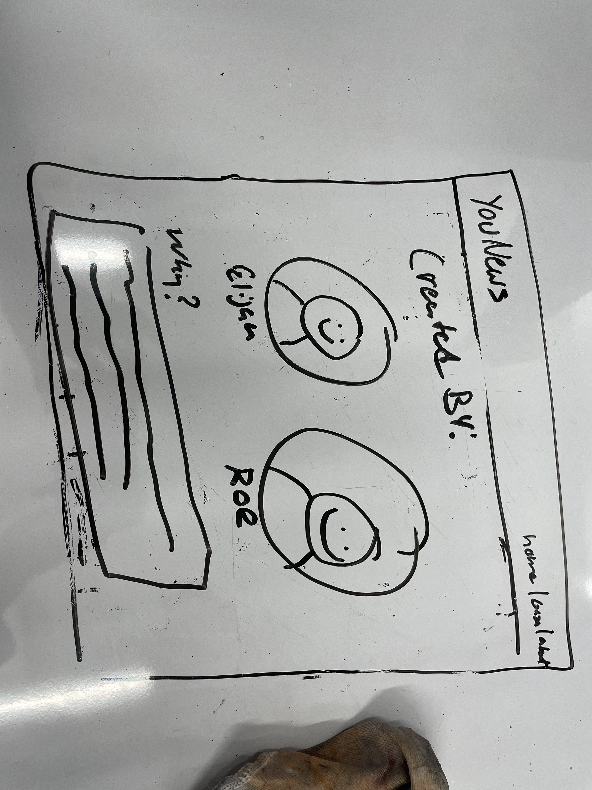

# YouNews

Created by Roe Cox and Elijah Hawes.

## 🚀 Mission statement

Our application, YouNews, is designed for users seeking a personalized news source. It allows users keep up with popular news stories, while also letting them browse articles based on topics relevant to the user.

## API & React Router

This application will use the New York Times API. Below are the documentation and specific endpoints we intend to use.

- Link to API documentation: [\[New York Times API\]](https://developer.nytimes.com/apis)
- [Most Viewed Article in Last Week](https://api.nytimes.com/svc/mostpopular/v2/viewed/1.json?api-key=yourkey)
  - [List of data values used by the endpoint]
- [Article Search](/articlesearch.json?q={query}&fq={filter})
  - [List of data values used by the endpoint]
- [Filter articles by tag](http://api.nytimes.com/svc/semantic/v2/concept)
  - [List of data values used by the endpoint]

**Example:**
- https://api.artic.edu/api/v1/artworks
  - This will fetch an array of artwork objects
  - For each artwork, I want the `id`, `title`, and `image_id`
- https://api.artic.edu/api/v1/artworks/{id}
  - This will fetch a single artwork object
  - I will use the `id`, `title`, `short_description`, `medium_display`, `place_of_origin` and `image_id`
- https://api.artic.edu/api/v1/artworks/search?q={query}
  - This will fetch a list of artworks that relate to the search query
  - For each artwork, I will use the `id` and `title`

## 👩‍💻 MVP User Stories & Frontend Routes

* Users can see the most viewed stories of the last 7 days
* Users can search for articles by keyword
* Users can filter articles by tag

## 🤔 Stretch User Stories

If time permits, the following stretch features will be implemented in order of priority:

* Users will be able to view articles related to Gaza on a timeline 
* Users will be able to change to dark mode or light mode 
* Users will be able to bookmark articles

**Example:**
* Users will be able to save and view favorited artworks using local storage
* Users will be able to change the color scheme of the website from light mode to dark mode

## 📆 Timeline for reaching MVP in 1 week

To ensure that we can complete all core features of the application in 1 week, we will aim to complete tasks according to the following timeline:

**Day 1**
- [ ] Test Fetches from 3 API endpoints on 3/18
- [ ] Create App Component on 3/18
- [ ] Create Navbar Component on 3/18

**Day 2**
- [ ] Create Trending Component on 3/19
- [ ] Create Search Bar Component on 3/19
- [ ] Create Container for Searched Articles on 3/19

**Day 3**
- [ ] Create Filter by Tag Component on 3/20
- [ ] About Page to the Navbar on 3/20
- [ ] Create modals to preview articles on hover on 3/20

**Day 4**
- [ ] Style Trending Component on 3/21
- [ ] Style Article Containers 3/21
- [ ] Style Home Page on 3/21 

**Day 5**
- [ ] Route to the Gaza Info Page on 3/22
- [ ] Make Most Viewed Articles scroll on a loop 3/22
- [ ] Add pages feature for article container on 3/22

## Wireframes of each page in your application

Below, you can find wireframes for our project. Each wireframe shows a different page of our application as well as the key components of the application. Details such as specific text values or images are intentionally not included:

