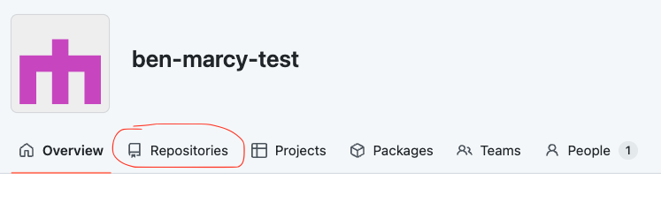
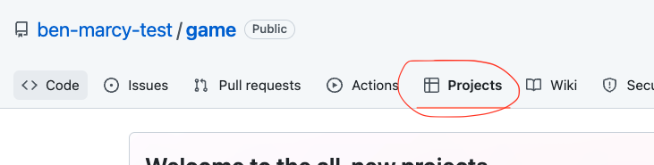
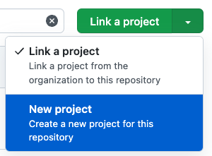
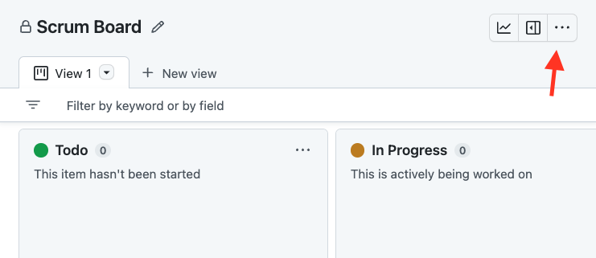

# Creating a Github Projects Scrumboard

**Table of Contents:**
- [Set up Github Organization](#set-up-github-organization)
- [Create an organization repository](#create-an-organization-repository)
- [Create a project board for the repository](#create-a-project-board-for-the-repository)

You will be using Github Projects to organize and manage your workflow. You can follow the instructions below to get started!

## Set up Github Organization
* Sign into Github
* In the top right corner, find the <kbd>+</kbd> icon and select <kbd>New organization</kbd>
* Select <kbd>Create a free organization</kbd>
* Name the organization with an approved team name
* One team-member will enter their email and will make the organization on their personal account.
* Add all teammates to the organization

## Create an organization repository
* From the organization overview page, click on the <kbd>Repositories</kbd> tab.

* Click on <kbd>Create a new repository</kbd>
* Give your repository a fun name that matches the name of your game!
* Make sure to make the repo **public**
* Add a **README**
* Choose the **MIT License** 

## Create a project board for the repository
* From the repository homepage, click on the <kbd>Projects</kbd> tab.

* Click on the dropdown next to <kbd>Link a project</kbd> and select <kbd>New project</kbd>

* Then, click on <kbd>New project</kbd>
    * Name the project board: “Scrum Board”
    * Create a **Board**, not a Table
* Modify the settings which can be found by clicking on the three dots <kbd>...</kbd> in the top right corner and then selecting **Settings**

  * [Optional] Add a description and a README
  * Change the visibility to **Public**

